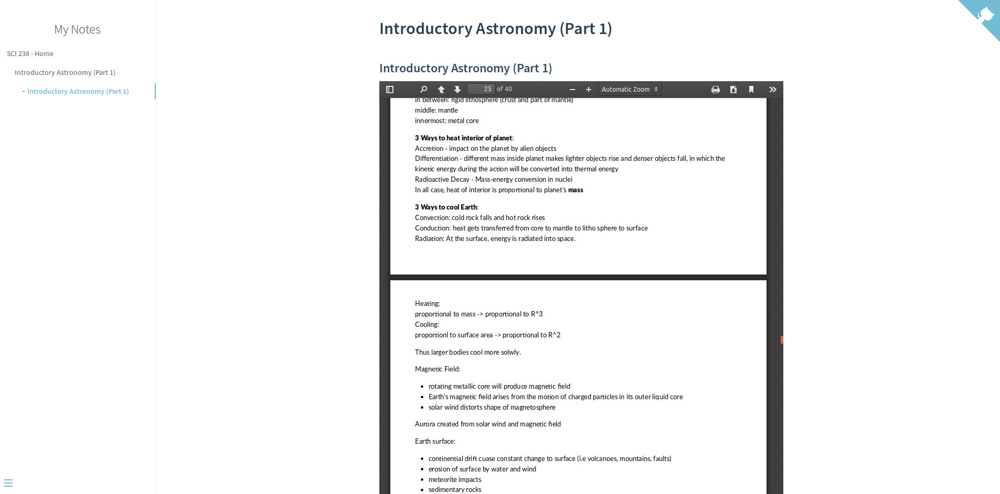

# Docsify PDF Embed Plugin
A simple plugin for embedding PDF in Docsify with the use of PDFObject.js

#### Simple Installation:

To use, simply put these 2 lines below where you import the `docsify.min.js` file.

```html
<!-- PDFObject.js is a required dependency of this plugin -->
<script src="//cdnjs.cloudflare.com/ajax/libs/pdfobject/2.1.1/pdfobject.min.js"></script> 
<!-- This is the source code of the pdf embed plugin -->
<script src="path-to-file/docsify-pdf-embed.js"></script>
<!-- or use this if you are not hosting the file yourself -->
<script src="//unpkg.com/docsify-pdf-embed-plugin/src/docsify-pdf-embed.js"></script>
```


Then, whenever you want to embed a PDF, type the following in the `.md` file that you want to put in:

```markdown
### Here are some of your previous markdown contents
blah blah blah

​```pdf
	path-to-the-pdf-file
​```
```





#### Remarks for users who have defined custom markdown parsing rules:

If you have custom parsing rules for code section of the markdown file (shown below), then you need to follow the next section.

```javascript
window.$docsify = {
    name: 'some name',
    repo: 'some git repository',
    homepage: 'some_homepage.md',
    notFoundPage: 'some_404_page.md',
    markdown: {
 	//If you have defined the follow section, 
        //then you need to follow the steps in the next section.
        //(only the code section matters in this plugin)
        /* SECTION START
        	
            code: function(code, lang){
            	some custom functions here
            	return some_custom_results;
            }
        	
        SECTION END */
    }
}
```


#### Quick fix for the above problem:

Put the block of code inside the `code: function(code, lang){ //put it here }` (the part that is mentioned above). Then put your previously defined custom parsing rules for markdown code section in the section mentioned in the comment block below.

```javascript
var renderer_func = function(code, lang, base=null) { 
	var pdf_renderer = function(code, lang, verify) {
		function unique_id_generator(){
			function rand_gen(){
				return Math.floor((Math.random()+1) * 65536).toString(16).substring(1);
			}
			return rand_gen() + rand_gen() + '-' + rand_gen() + '-' + rand_gen() + '-' + rand_gen() + '-' + rand_gen() + rand_gen() + rand_gen();
		}
		if(lang && !lang.localeCompare('pdf', 'en', {sensitivity: 'base'})){
			if(verify){
				return true;
			}else{
				var divId = "markdown_code_pdf_container_" + unique_id_generator().toString();
				var container_list = new Array();
				if(localStorage.getItem('pdf_container_list')){
					container_list = JSON.parse(localStorage.getItem('pdf_container_list'));	
				}
				container_list.push({"pdf_location": code, "div_id": divId});
				localStorage.setItem('pdf_container_list', JSON.stringify(container_list));
				return (
					'<div style="margin-top:'+ PDF_MARGIN_TOP +'; margin-bottom:'+ PDF_MARGIN_BOTTOM +';" id="'+ divId +'">'
						+ '<a href="'+ code + '"> Link </a> to ' + code +
					'</div>'
				);
			} 
		}
		return false;
	}
	if(pdf_renderer(code, lang, true)){
	   return pdf_renderer(code, lang, false);
	}
	/* SECTION START: Put other custom code rendering functions here
		i.e. If the language of the code block is LaTex, 
		put the code below to replace original code block with the text: 
		'Using LaTex is much better than handwriting!' inside a div container.

		if (lang == "latex") {
			return ('<div class="container">Using LaTex is much better than handwriting!</div>');
		}

	SECTION END */
	return (base ? base : this.origin.code.apply(this, arguments));
}
```


Congrats! Now you have PDF embedding functionality for your use cases of Docsify.


__Acknowledgement__:

> Thanks to [njleonzhang](https://github.com/njleonzhang/docsify-edit-on-github/)'s Docsify edit on GitHub plugin for being an inspiration
